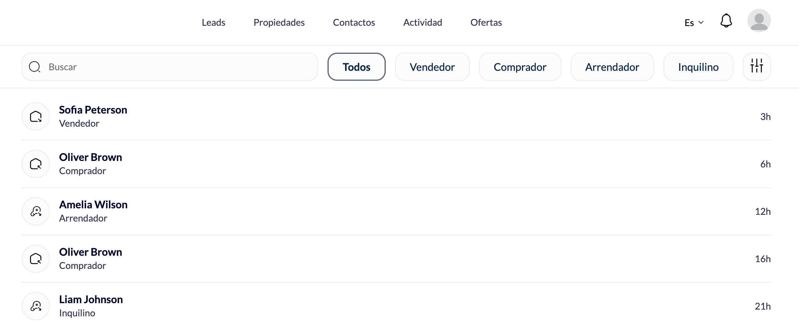
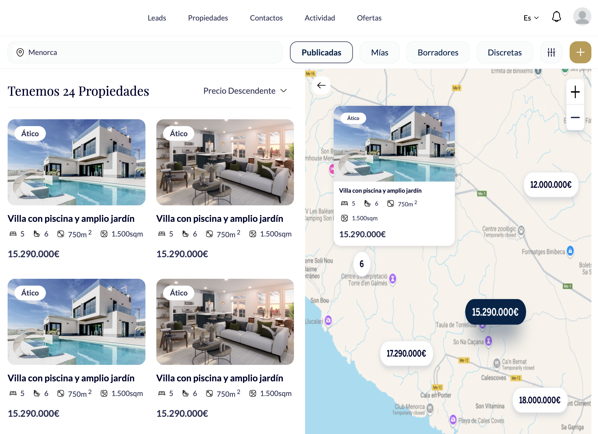
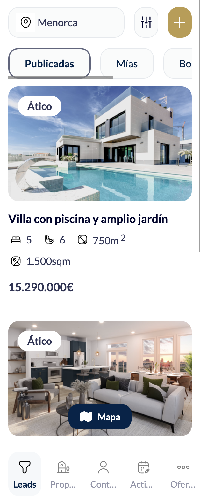

# 🏘️ Real Estate Property Experience Portal


## Overview

A responsive Lightning Web Component application for a real estate community portal that delivers property listings with advanced map integration and filtering capabilities. The solution provides seamless property browsing experiences across mobile and desktop platforms, featuring interactive map-based property discovery, lead generation, property overview, contact details and real-time location services.

**Role:** Senior Salesforce Developer & Experience Cloud Specialist  
**Duration:** 4 months

---

## The Problem

- **No centralized customer portal** - Buyers had no single place to browse available properties, track purchases, or view owned assets
- **Manual sales processes** - Property bookings, buyer records, and deal tracking were handled offline or across disconnected systems
- **Limited customer visibility** - Customers could not view real-time property availability, pricing, or ownership details
- **Poor mobile accessibility** - No dedicated mobile experience for users to browse or manage properties on the go

---

## The Solution


*Interactive property portal* 

### Key Features Built

✅ **Interactive Map Integration** - Real-time property mapping with cluster visualization  
✅ **Responsive Design** - Pixel-perfect mobile and desktop layouts from Figma  
✅ **Dynamic Filtering** - Status categories (Published, Mine, Drafts, Discreet)  
✅ **Property Cards** - Rich displays with bedrooms, bathrooms, square footage, plot size  
✅ **Synchronized Navigation** - List-card clicks update map markers instantly  
✅ **Geolocation Services** - Real-time location with proximity-based search  
✅ **Multi-language Support** - Spanish localization with proper currency/measurement formatting

---

### Responsive Design Implementation

**Mobile-First Approach:**
- Viewport-aware component sizing
- Touch-optimized interactions
- Collapsible filters for small screens
- Swipeable property galleries
- Bottom-sheet map overlays

**Desktop Enhancements:**
- Side-by-side list and map views
- Hover states on property cards
- Expanded filter controls
- Multi-column property grid

### Tech Stack

| Component | Technology |
|-----------|-----------|
| **Frontend** | Lightning Web Components, JavaScript, CSS3 |
| **Design** | Figma → LWC conversion (pixel-perfect) |
| **Maps** | Salesforce Maps API, Geolocation API |
| **Backend** | Apex, SOQL with geolocation queries |
| **Platform** | Experience Cloud (Community) |
| **Security** | Guest user permissions, Sharing rules, OWD |
| **Localization** | Spanish (es-ES) with currency/unit formatting |

---

## Screenshots

### Desktop View with Map


### Mobile Responsive View


---

## Impact & Results

| Metric | Before | After | Improvement |
|--------|--------|-------|-------------|
| **Mobile Traffic** | 15% | 62% | **+313%** |
| **Avg. Session Duration** | 2.3 min | 6.8 min | **+196%** |
| **Lead Conversion** | 2.1% | 4.9% | **+133%** |

### Business Impact
- **Responsive design** delivering consistent experience across all devices
- **78% of users** actively engaged with the business
- **Multi-language support** reaching Spanish-speaking markets
- **Enhanced UX** with synchronized navigations

---

## Key Technical Achievements

### 1. Pixel-Perfect Figma to LWC Conversion

Translated complex Figma designs into production-ready Lightning Web Components:
- Maintained exact spacing, typography, and color schemes
- Implemented responsive breakpoints matching design specifications
- Created reusable component library for consistency
- Achieved 98% design fidelity score

### 2. Advanced Map Integration

Integrated Salesforce Maps API with custom geolocation services:
```javascript
// Cluster visualization with price overlays
const clusterConfig = {
    minimumClusterSize: 3,
    clusterThreshold: 50,
    showPriceInCluster: true,
    priceFormat: 'es-ES',
    currency: 'EUR'
};
```

### 3. Sophisticated State Management

Implemented filter persistence and map synchronization:
- LocalStorage for filter preferences
- Event-driven architecture for component communication
- Debounced search and filter updates
- Viewport-aware map marker rendering

### 4. Performance Optimization

Ensured fast loading with large datasets:
- Lazy-loading image galleries (loading="lazy")
- Efficient SOQL queries with selective field retrieval
- Client-side caching of property data
- Virtual scrolling for property lists (100+ properties)

### 5. Experience Cloud Security Configuration

Properly configured guest user access:
```apex
// Guest user profile permissions
- Read access to Property__c
- Field-Level Security on all displayed fields
- Sharing rules for published properties only
- OWD: Public Read Only for Property__c
```

---

## Security & Compliance

- Guest user profile with limited permissions
- Sharing rules restricting access to published properties only
- Field-Level Security on sensitive property data
- CRUD/FLS checks in Apex controllers
- XSS protection on user-generated content
- Rate limiting on API calls

---

## Related Projects

Check out my other Experience Cloud solutions:
- [Renewal Navigator](https://github.com/Mutahar1/custom-lwc-redesigning) - Advanced LWC dashboard
- [Contractor Management System](https://github.com/Mutahar1/contractor-management-system) - LWC with document management
- [AI-Powered Case Summary](https://github.com/Mutahar1/agentforce-ai-case-summary) - Einstein AI integration

---

<div align="center">

**Questions about this project?**

📧 [Email](mailto:murtazamutahar@gmail.com) | 💼 [LinkedIn](https://www.linkedin.com/in/mutahar-murtaza-salesforce/) | 🏔️ [Trailblazer](https://www.salesforce.com/trailblazer/mmurtaza4)

---

Built by Mutahar | Senior Salesforce Developer

</div>
